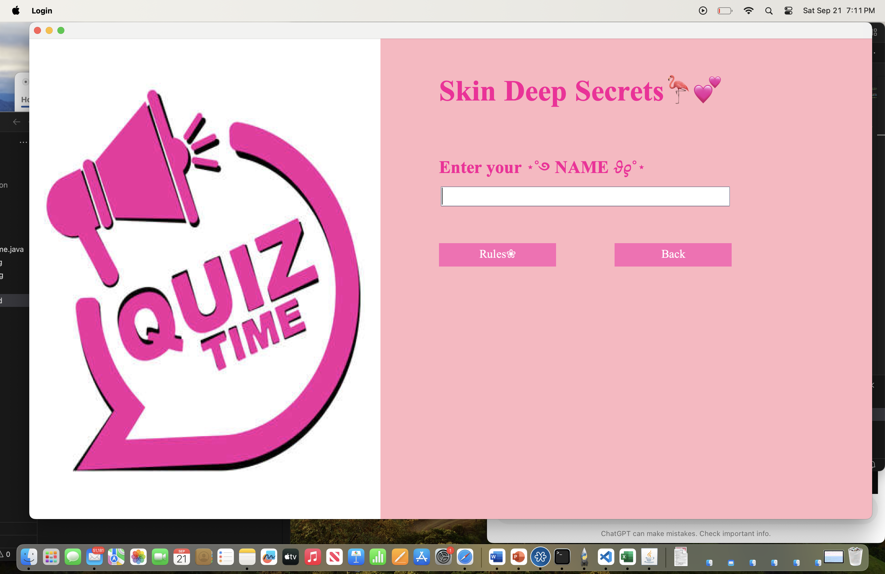
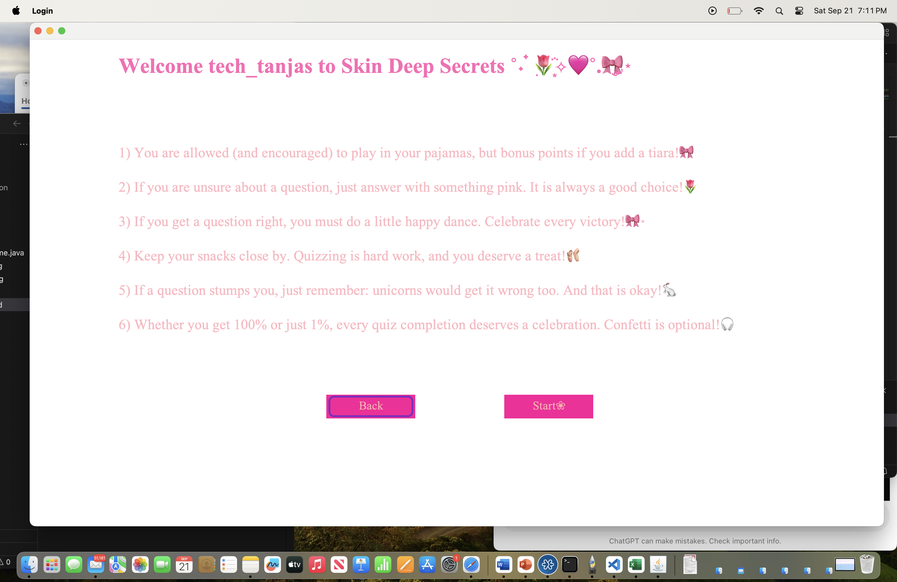
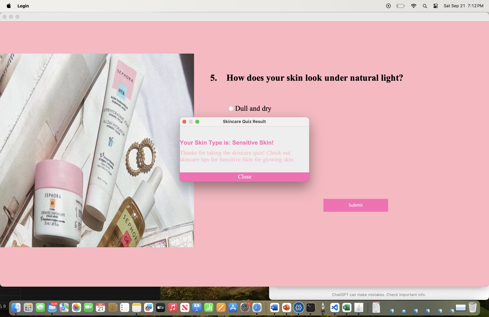

*Skincare Quiz Application*

This is a simple Java-based quiz application designed to help users identify their skin type through a series of questions. The quiz features a visually appealing, girly, and pink-themed UI, complete with radio button selections for multiple-choice answers. After answering all questions, the quiz determines and displays the user's skin type, such as "Dry Skin," "Normal Skin," "Oily Skin," or "Sensitive Skin," in a stylish result dialog box.

*Features*

1) 5 Multiple-Choice Questions: Users answer questions about their skincare routine, and based on the responses, their skin type is determined.
2) Pink-Themed UI: The user interface is designed with pink tones to give it a girly, skincare-oriented look.
3) Responsive Dialogs: Each question must be answered before the user can proceed to the next, and the final result is presented in a themed dialog box.
4) Result Calculation: The application calculates the most likely skin type based on the user's answers.
5) Custom Background and Image: A skincare-related image is displayed, along with the quiz questions to create an engaging environment.

*Screenshots*

*Requirements*

Java: This game requires Java 8 or higher.

*How to Use*

1) Start the Quiz:
Upon starting the application, you'll see a pink-themed quiz interface with a skincare banner image on the left and the questions on the right.
2) Answer the Questions:
For each of the 5 questions, select one answer by clicking on the corresponding radio button.
3) After selecting your answer, click "Next" to proceed to the next question.
If no answer is selected, a warning dialog will prompt you to choose an option before continuing.
4) Submit the Quiz:
After answering the final question, click the "Submit" button to view your result.
5) View Your Skin Type:
A dialog box will display your skin type along with a brief thank-you message and some skincare tips.
Click "Close" to exit the quiz.
